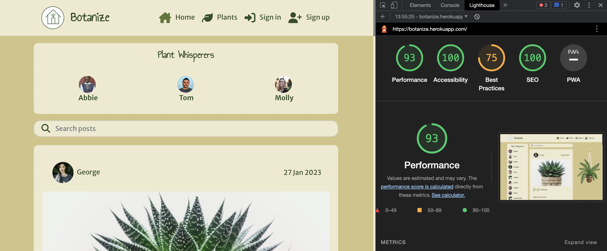
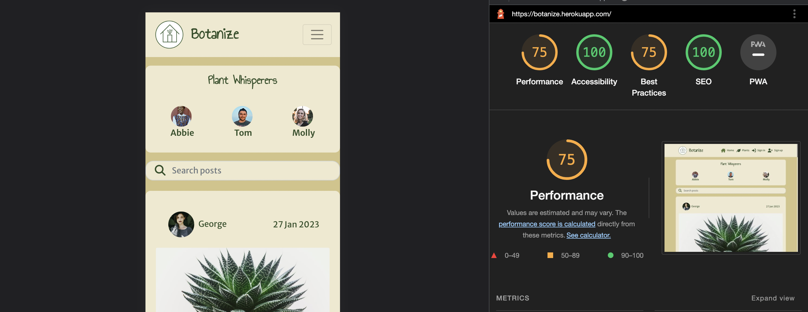
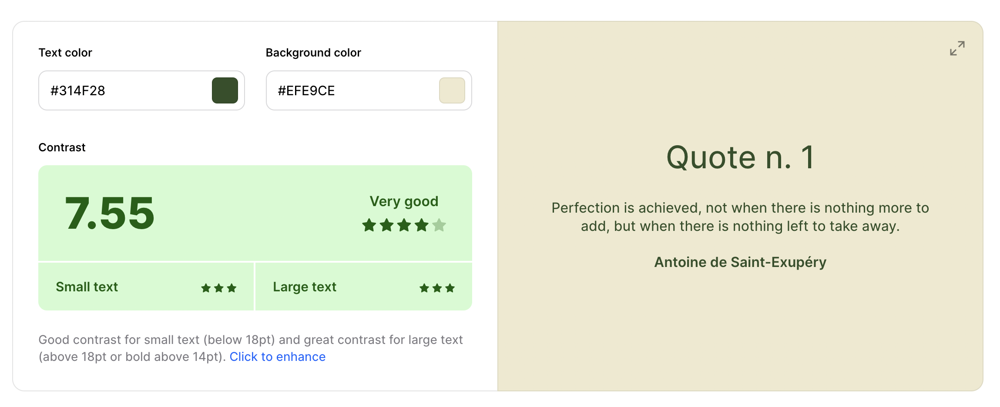

# Botanize

For my project five milestone, I have created the social platform Botanize, the site offers a space where plant owners can come to share images and problems they are facing with their plants, so other users can answer and help them with tips and solutions. Alongside this, users can upload images and content about their favourite plants for others to view.

- [View live project](https://botanize.herokuapp.com/)
- [Deployed API](https://botanize-api.herokuapp.com/)
- [Backend Repository](https://github.com/EJDiamond/drf-api-botanize)


# Table of contents
1. [User Experience](#user-experience(ux))
    - [Site Purpose](#site-purpose)
    - [Site Goals](#site-goals)
    - [Audience](#audience)
    - [Communication](#communication)
    - [Current User Goals](#current-user-goals)
    - [New User Goals](#new-user-goals)
    - [Future goals](#future-goals)
    - [Design](#design)
        - [Typography](#typography)
        - [Colour](#colour)
        - [Wireframes](#wireframes)
        - [Database Schema](#database-schema)
2. [User Stories](#userstories)
3. [Features](#features)
    - [Existing Features](#existing-features)
    - [Future Features](#future-features)
4. [Technologies Used](#technologies-used)
    - [Main Languages](#main-languages)
    - [Frameworks Libraries & Programs Used](#frameworks-libraries-and-programs-used)
    - [React Library Benefits](#react-library-benefits)
5. [Components](#components)
6. [Testing](#testing)
    - [Validator testing](#validator-testing)
    - [Manual Testing](#manual-testing)
7. [Bugs and Fixes](#bugs-and-fixes)
8. [Deployment](#deployment)
9. [Credits](#credits)
10. [Acknowledgements](#acknowledgements)

# User Experience(UX)

## Site Purpose

Botanize is a platform for plant lovers alike. The purpose of the app is for plant enthusiasts to come together and share their love and knowlegde of house plants. By allowing users to share content of their plants with info and questions, other users are then given the opportunity to answers and provide information. The main purpose of the site is to information on how people can better care for their plants.

## Site goals

Botanize aims to bring plant owners together, whilst building an archive of plant problems and solutions that other users can search through and hopefully use to remedy problems they have with their own plants. The site will also provide users with the option to post pictures of their beloved plants to share with the community.

## Audience

The target audience for Botanize are:

- Lovers of houseplants.
- People looking for advice and tips in how to  care for their plants.
- People interested in giving advice and sharing their knowledge of plants.
- People looking to show others their own plants.

## Communication

Botanize is intended to resemble existing social platforms so users feel familiar and can navigate the site with ease. The navigation bar is available throughout the site so the user can quickly move across desired pages.

## Current User Goals

Current users will be able to find solutions to their plant problems by posting and returning to the site to find answers other users have given. The will be able to search for similar issues other users have experienced to see if they can find answers there.

## New User Goals

To interest new users into using the site for any plant issues or adive they may have.

## Future Goals

- To implement a profiles page where user profiles can be scrolled through and followed by other users.
- To provide the ability for users to send direct messages to one another.

## Design

### Typography

I chose the two fonts Merriweather Sans and Annie use your telescope:

- [Annie use your telescope](https://fonts.google.com/specimen/Annie+Use+Your+Telescope?query=Annie) was used for the navbar brand all the headings on the page.

- [Merriweather Sans](https://fonts.google.com/specimen/Merriweather+Sans?query=merri) was used across the body of the site.

### Colour


### Wirefames


### Database Schema

The database model can be found in Backend README.md file found [here](https://github.com/EJDiamond/drf-api-botanize)

# User Stories

My user stories can be found [here](https://github.com/users/EJDiamond/projects/6).

# Features

## Existing Features

#### - __Navigation Bar__


#### - __Navigation Bar Logged In__


#### - __Navigation Bar Mobile__


#### - __Homepage__


#### - __Search Bar__


#### - __Plant whispereres - most popular profiles__


#### - __Sign Up Page__


#### - __Sign In page__


#### - __Create Post__


#### - __Answer Form__


#### - __Like comment__


#### - __Profile Page__


#### - __Plants Page__


#### - __Create Plant__


## Future Features

- Notifications:
    - When someone follows you.
    - When someone answers your question.
- Profile can be set to private if user wishes.
- Direct messages between users.
- The ability to like and bookmark plants.
- The ability to leave comments on plants.

# Technologies Used

## Main Languages

- HTML5
- CSS
- Python
- Javascript

## Frameworks, Libraries and Programs Used

- [Django](https://www.djangoproject.com/)
    - Frame works used to build the backend of the project.
- [Github](https://github.com/)
    - Used to save project code from Git.
- [Gitpod](https://www.gitpod.io/)
    - The develpment environment used to build project.
- [React Bootstrap](https://react-bootstrap.github.io/)
    - Used for creating the layout and ensuring responsive design
- [SQLite](https://www.sqlite.org/index.html)
    - Used to run local database test
- [ElephantSQL](https://www.elephantsql.com/)
    - Database used to store data once deployed
- [ReactJS](https://reactjs.org/)
    - USed to build the components for the front end application
- [Drawspl](https://drawsql.app/)
    - Used to mock up models for database
- [Heroku](https://www.heroku.com)
    - Platform used to build and host site.
- [Adobe Illustrator](https://www.adobe.com/)
    - Used to build wireframes and do all image resizing
- [Cloudinary](https://cloudinary.com/)
    - Used to store all images
- [Favicon.io](https://favicon.io/)
    - Used to create favicon for site
- [FontAwesome](https://fontawesome.com/)
    - Used to get items form my contact details and room features
- [Google Fonts](https://fonts.google.com/)
    - Used to get fonts for the project.
- [AmIResponsive](https://ui.dev/amiresponsive)
    - Used to create image to show the site is responsive

## React Library Benefits

The data rendering feature of the React library creates an improved user experience by allowing the user to move through the site more efficiently. The data is fetched and updated without refreshing the page each time a user clicks or scrolls, making for a smoother, more enjoyable user experience.

# Components

- OptionDropdown.js is used on the post and plant pages to offer edit and delete and on the profile page to offer edit.
- Asset.js includes a loading spinner and is used at several locations across the sight.
- axiosDefaults.js a component used on a few pages to communicate with the backend.
- useRedirect is used to redirect users to another page if they are not logged in.
- utils.js is used so that users can use the infinte scroll function on the posts and plant page as well as scroll the answers.
- Avatar.js displays the users profile images at different places across the site.
- ProfileDataContext.js provide the user with ability to follow/unfollow user in the plant whisperers component and the profile page.
- CurrentUserContext.js confirms the users logged in status, showing what functionality is availbe to the user.

# Testing

A combination of both manual and automated testing has been used to check the webistes functionality.

## Code Validation

#### - __JSHint__
- All javascript files pass through JSHint showing no errors, an example of this is shown below using ```App.js```


#### - __W3C CSS Validation Service__

- Used to validate the css code used in the website.


#### - __Lighthouse__

- Used to test the code for accessibility.




#### - __Coolors Contrast Checker__
- Used to check the contract of the text and background colors.



## Manual Testing

I have tested this code myself on multiple screen sizes as well as asking friends and family to review on different size devices.

| **Test**                               | **User Story**                                                                                                                           | **Pass/Fail**                                                                                                                                    |
|----------------------------------------|------------------------------------------------------------------------------------------------------------------------------------------|--------------------------------------------------------------------------------------------------------------------------------------------------|
| 1. Navigation                          | As a user I can view the navbar from every page so that I can navigate the site easily.                                                  | [Pass](https://github.com/EJDiamond/botanize/blob/4e9d4f5faf88c2f1a0f58bfffdb6111e44da9c57/src/assets/testing/test-navbar.png)                   |
| 2: Routing                             | As a user I can navigate through pages quickly so that I can view content seamlessly  without page refresh.                              | Pass                                                                                                                                           |
| 3. Sign up                             | As a user I can create a new account so that I can access all the features for signed up users.                                          | [Pass](https://github.com/EJDiamond/botanize/blob/4e9d4f5faf88c2f1a0f58bfffdb6111e44da9c57/src/assets/testing/test-signup.png)                   |
| 4. Sign In                             | As a user I can sign in to the app so that I can access functionality for logged in users.                                               | [Pass]( https://github.com/EJDiamond/botanize/blob/4e9d4f5faf88c2f1a0f58bfffdb6111e44da9c57/src/assets/testing/test-signin.png)                  |
| 5. Logged-in status                    | As a user I can tell if I am logged-in or not so that I can log in if I need to.                                                         | [Pass](https://github.com/EJDiamond/botanize/blob/4e9d4f5faf88c2f1a0f58bfffdb6111e44da9c57/src/assets/testing/test-signedin.png)                 |
| 6. Refreshing access    tokens         | As a user I can maintain my logged-in status until I choose to log out so that my user  experience is not compromised.                   | Pass                                                                                                                                           |
| 7. Conditional     rendering           | As a logged out user I can see sign in and sign up options so that I can sign in/sign up.                                                | [Pass](https://github.com/EJDiamond/botanize/blob/4e9d4f5faf88c2f1a0f58bfffdb6111e44da9c57/src/assets/testing/test-conditional-rendering.png)    |
| 8. Avatar                              | As a user I can view user's avatars so that other users can be easily identified.                                                        | [Pass](https://github.com/EJDiamond/botanize/blob/4e9d4f5faf88c2f1a0f58bfffdb6111e44da9c57/src/assets/testing/test-avatar.png)                   |
| 9. Create post                         | As a user I can create a post so that other users can help me identify issues with my plant.                                             | [Pass](https://github.com/EJDiamond/botanize/blob/4e9d4f5faf88c2f1a0f58bfffdb6111e44da9c57/src/assets/testing/test-create-post.png)              |
| 10. View post                          | As a user I can view a single post so that I can learn more about it.                                                                    | [Pass](https://github.com/EJDiamond/botanize/blob/4e9d4f5faf88c2f1a0f58bfffdb6111e44da9c57/src/assets/testing/test-view-post.png)                |
| 11. Edit post                          | As a user I can edit a post I have made so that I can make any changes that are needed.                                                  | [Pass](https://github.com/EJDiamond/botanize/blob/4e9d4f5faf88c2f1a0f58bfffdb6111e44da9c57/src/assets/testing/test-edit-post.png)                |
| 12. Bookmark post                      | As a user I can bookmark a post I am interested in so that I can refer back to it and see what  answers people have given.               | [Pass](https://github.com/EJDiamond/botanize/blob/4e9d4f5faf88c2f1a0f58bfffdb6111e44da9c57/src/assets/testing/test-bookmark.png)                 |
| 13. Explore page                       | As a user I can view all the most recent posts, ordered by most recently created first so that I  am up to date with the newest content. | [Pass](https://github.com/EJDiamond/botanize/blob/4e9d4f5faf88c2f1a0f58bfffdb6111e44da9c57/src/assets/testing/test-explore.png)                  |
| 14. View posts from     followed users | As a user I can go to my home page and see posts from the users I follow so that I can keep up  to date with what they are posting       | [Pass](https://github.com/EJDiamond/botanize/blob/4e9d4f5faf88c2f1a0f58bfffdb6111e44da9c57/src/assets/testing/test-view-followed-posts.png)      |
| 15. Search posts                       | As a user I can search for posts with keywords, so that I can find the posts I am most  interested in.                                   | [Pass](https://github.com/EJDiamond/botanize/blob/4e9d4f5faf88c2f1a0f58bfffdb6111e44da9c57/src/assets/testing/test-search-posts.png)             |
| 16. View bookmarked    posts           | As a user I can view the posts I have saved in bookmarks so that I view them again.                                                      | [Pass](https://github.com/EJDiamond/botanize/blob/4e9d4f5faf88c2f1a0f58bfffdb6111e44da9c57/src/assets/testing/view-bookmarked-posts.png)         |
| 17. Add answer                         | As a user I can add an answer to a question another user has posted so that I can give them advice  and tips.                            | [Pass](https://github.com/EJDiamond/botanize/blob/4e9d4f5faf88c2f1a0f58bfffdb6111e44da9c57/src/assets/testing/test-add-answer.png)               |
| 18. Answer date                        | As a user I can see when an answer was given so that I know how old it is.                                                               | [Pass](https://github.com/EJDiamond/botanize/blob/4e9d4f5faf88c2f1a0f58bfffdb6111e44da9c57/src/assets/testing/test-answer-date.png)              |
|  19. View answers                      | As a user I can view answers other users have given so that I can learn from them or add additional  comments.                           | [Pass](https://github.com/EJDiamond/botanize/blob/4e9d4f5faf88c2f1a0f58bfffdb6111e44da9c57/src/assets/testing/test-view-answers.png)             |
| 20. Edit answers                       | As a user I can edit an answer I have given on a post so that I can make change to it if I desire.                                       | [Pass](https://github.com/EJDiamond/botanize/blob/4e9d4f5faf88c2f1a0f58bfffdb6111e44da9c57/src/assets/testing/test-edit-answer.png)              |
| 21. Delete answer                      | As a user I can delete an answer I have given so that I can control removal of my answer if I wish.                                      | [Pass](https://github.com/EJDiamond/botanize/blob/4e9d4f5faf88c2f1a0f58bfffdb6111e44da9c57/src/assets/testing/test-delete-answer.png)            |
| 22. Like answer                        | As a user I can like an answer another user has given so that I can show if I think it would work  or has worked for me.                 | [Pass](https://github.com/EJDiamond/botanize/blob/4e9d4f5faf88c2f1a0f58bfffdb6111e44da9c57/src/assets/testing/test-like-answer.png)              |
| 23. Create plant                       | As a user I can post pictures and info about my favourite plants so that I can share them with  others.                                  | [Pass](https://github.com/EJDiamond/botanize/blob/4e9d4f5faf88c2f1a0f58bfffdb6111e44da9c57/src/assets/testing/test-add-plant.png)                |
| 24. Edit plant post                    | As a user I can edit my plant post so that I can make any changes I want.                                                                | [Pass](https://github.com/EJDiamond/botanize/blob/4e9d4f5faf88c2f1a0f58bfffdb6111e44da9c57/src/assets/testing/test-edit-plant.png)               |
| 25. Delete plant post                  | As a user I can delete a post of a plant so that I can remove it if I no longer want to share it.                                        | [Pass](https://github.com/EJDiamond/botanize/blob/4e9d4f5faf88c2f1a0f58bfffdb6111e44da9c57/src/assets/testing/test-delete-plant.png)             |
| 26. View user's     plants             | As a user I can view plants other users have posted so that I can scroll and look at different plants.                                   | [Pass](https://github.com/EJDiamond/botanize/blob/4e9d4f5faf88c2f1a0f58bfffdb6111e44da9c57/src/assets/testing/test-view-users-plants.png)        |
| 27. Profile page                       | As a user I can view other users profiles so that I can see their posts and learn more about them                                        | [Pass](https://github.com/EJDiamond/botanize/blob/4e9d4f5faf88c2f1a0f58bfffdb6111e44da9c57/src/assets/testing/test-profile.png)                  |
| 28. Most followed    profiles          | As a user I can see a list of the most followed profiles so that I can see which profiles are  popular.                                  | [Pass](https://github.com/EJDiamond/botanize/blob/4e9d4f5faf88c2f1a0f58bfffdb6111e44da9c57/src/assets/testing/test-popular-profiles.png)         |
| 29. User profile                       | As a user I can view stats about a specific user: bio, number of posts, follows and users followed  so that I can learn more about them. | [Pass](https://github.com/EJDiamond/botanize/blob/4e9d4f5faf88c2f1a0f58bfffdb6111e44da9c57/src/assets/testing/test-user-profile.png)             |
| 30. Follow/unfollow                    | As a logged in user I can follow and unfollow users so that I can see posts from user I want.                                            | [Pass](https://github.com/EJDiamond/botanize/blob/4e9d4f5faf88c2f1a0f58bfffdb6111e44da9c57/src/assets/testing/test-follow-unfollow.png)          |
| 31. View specific    user posts.       | As a user I can view posts owned by a specific user so that I can view their latest issues.                                              | [Pass](https://github.com/EJDiamond/botanize/blob/4e9d4f5faf88c2f1a0f58bfffdb6111e44da9c57/src/assets/testing/test-view-user-posts.png)          |
| 32. Edit profile                       | As a registered user I can edit my profile so that I can make changes to my profile pic and bio.                                         | [Pass](https://github.com/EJDiamond/botanize/blob/4e9d4f5faf88c2f1a0f58bfffdb6111e44da9c57/src/assets/testing/test-edit-profile.png)             |
| 33. Update username    and password    | As a registered user I can change my username and password so that I can change my displayed  name and keep my profile secure.           | [Pass](https://github.com/EJDiamond/botanize/blob/4e9d4f5faf88c2f1a0f58bfffdb6111e44da9c57/src/assets/testing/test-update-password-username.png) |

## Bugs and Fixes

- There was an issue with my plants_type field not showing the human friendly value so I add a serialiser to use in my post and plant forms to remedy this.
- There was a problem with the user being able to log out, fixed by adding at logout view in the API.

# Deployment

Botanize was deployed using Heroku, following the steps below:

1. Create and launch Gitpod workspace.
2. Install ReactJS:
    ```
    npx create-react-app . --template git+https://github.com/Code-Institute-Org/cra-template-moments.git --use-npm
    npm start
    ```


3. Install the relevant packages using ```npm install```
    ```
    react-bootstrap@1.6.3 bootstrap@4.6.0
    react-router-dom@5.3.0
    axios
    react-infinite-scroll-component
    msw --save-dev
    jwt-decode
    ```
4. Save changes by using git add, commit and push.
5. Create a repository (ensuring the name is lower case), select the Gitpod button to create the workspace.
6. Connect to the API by navigating to the Heroku app for the DRF-API and under settings, config vars at the following  (ensuring the trailing slash has been remove on each):
    Key - CLIENT_ORIGIN         Value - https://botanize.herokuapp.com
    key - CLIENT_ORIGIN_DEV     Value - https://3000-ejdiamond-botanize-8eox21ff9a5.ws-eu83.gitpod.io
7. Add axiosDefaults.js to connect to the backend.
8. In the ```scripts``` section of ```package.json`` add the following:
    ```"heroku-prebuild": "npm install -g serve",```
9. Add a Procfile to the root of the app and add:
    ```
    web: serve -s build
    ```
10. Save changes by using git add, commit and push.
11. Deploy using the deploy button on Heroku.

# Credits

- Botanize was created following the Code Institute [Moments walkthrough](https://learn.codeinstitute.net/courses/course-v1:CodeInstitute+RA101+2021_T3/courseware/70a8c55db0504bbdb5bcc3bfcf580080/953cd4e5015f483bb05263db3e740e19/) project and building on it to customise and make it my own.
- [Sourced Images - Unsplash](https://unsplash.com/)

# Acknowledgements

I would like to thank my mentor Naoise Gaffney for his constant support throughout my project.